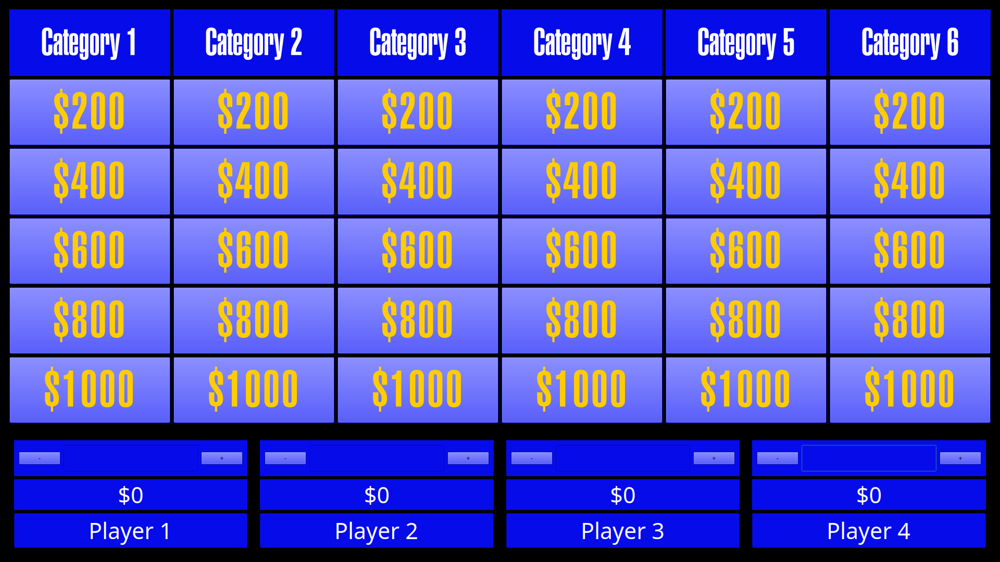

# Jep!
Simple Jeopardy game in Python using the PyQt6 framework. I made this primarily for use with my
friends for use over video chats, where I serve as the host and they buzz in their answers.

## Overview
Below is a screenshot of the program. The game is played the same as normal Jeopardy. If you don't
know how to play Jeopardy, see [here](https://en.wikipedia.org/wiki/Jeopardy!)

The game controls are detailed below.

## Dependencies
This project depends heavily on the PyQt6 framework. In order to play the sounds, the mpv media
player must be installed on your system as well.

## License
This software is licensed under the MIT License. Do whatever you want
with it according to that license.
